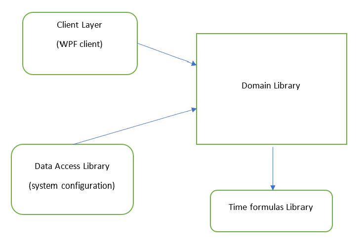

# Programming Notes
**TimeConverter WPF Application** - Converting time to second since midnight.

_by Armando A. Pensado_

### Characteristics and NuGet dependencies

.NET WPF application using .NET 4.8 and C#

Intermediate level

**NuGet dependencies**

For this project several NuGet libraries were used. These are listed as bellow. The reader must keep in mind that when installing the NuGet libraries, additional dependencies are installed. 

1. MahApps.Metro
2. MahApps.Metro.IconPacks
3. Moq
4. MSTest.TestAdapter
5. Unity

## Description 

This project is a **NET WPF** application and it is a very simple application with functionality to convert time into second since midnight and vice versa. 

Although, it is a very simple concept, the exercise presents a .NET application with several formalities, as dividing functionality into layers, including clear separation concerns, seams for dependency injection. The exercise takes advantage of dependency injection using Microsoft Unity and unit testing using MOQ.

The application is separated in such a way that if the reader wants to use a different frontend (Client) other that the WPF client, it should be straight forward task. The example uses some of valuable principles contained in the book _Dependency Injection in .Net_ by _Mark Seemann_. 

One final note for the reader is that this projects takes advantage of **mahapps.metro** styling for WPF applications, which is a simple way to provide a metro-style user interface (e.g. Window 10 style).

## How does it works

The application has three critical layers for the functionality, represented by projects, these are as follows:

1. Client: TimeConverter.WpfClient.
2. Domain: TimeConverter.Domain
3. Data Access Layer: TimeConverter.DataAccess

They key principle is to follow Mark Seemann advice, and draw a dependency graph that puts the domain layer at the center, forcing the client and data access layers to implement or use domain interfaces. This way, any new version of a client or a data access layers, can be implemented as long these obey the interfaces dictated by the domain. 

The dependency graph for this application can be depicted as follows: 

The graph indicates that the client and data access layer must reference the domain layer. 

The domain layer will expose interfaces (or contracts) for repositories and services that need to be implemented in order to stay compatible with the application. 

In this particular example, and because is a very simple application, the data access layers is used to save the user preferences into the local drive using XML serialization.

The Domain layer offers repositories interfaces to implement the user preferences (IUserConfigRepository.cs)and time conversion functionality (ITimeConverterRepository.cs).  

Additionally, it offers interfaces for services exercising the user preferences and time conversion functionality repositories (IUserConfigService and ITimeConverterService).

It is during the implementation of these services that a repository can be injected. It can be any assembly that as long the implement the contracts, the application should be able to use them.

Now, the domain layer offers an internal implementation of the time conversion interface (ITimeConverterRepository), but this can be replaced for an external one when defining the services.

The WPF client has the root composition (or place to implement injection) in the ViewModelLocator. This locator is used by the XAML when rendering the front end. 

It is in this place that the application, reading from the app.Config, determines what assemblies to use for user preferences and time conversion functionality.

The client offers three ways to inject the dependencies:

1. By code
2. BY configuration
3. By DI container (in this case MS Unity)

To simplify things, the Domain layer offer classes for the services, which implements the services interfaces. The client uses this services in the view model locator. 

For example, examining the simpler option injecting dependencies by code, the reader can form an idea about the relationship between services and repositories:

~~~C#
 // Repositories
_userConfigRepository = new DataAccess.ConfigurationRepository();
_timeConverterRepository = new Domain.Functionality.TimeConvertionFunctions();

// Services (represent the seam in the architecture)
_userConfigService = new Domain.Services.UserConfigService(ConfigFilename, _userConfigRepository);
_timeConverterService = new Domain.Services.TimeConverterService(_timeConverterRepository);
~~~

Finally, the application offers examples for implementing Unit testing using Microsoft unit testing tools. The unit test for the data access layer and core libraries are straight forward. 

However, they get interesting when testing the domain layer. In here the reader will observe the use of the MOQ library, and the DI container. The code offers two examples per case, one using only MOQ library and a second sing MOQ and the DI container working together. 

## Who can benefit from this application

This example is beneficial for C# developers, providing a very simple structured program to help understand the separation of the layers, dependency injection, and strategy pattern impersonated by the services and repositories. 

## How developers can get started

Clone the repository or download it, and by rebuilding the application the NuGet dependencies should be installed. If this does not happen, please use the NuGet restore command. Once the dependency libraries are in place, the application should be operational.

The applicaiton layout should look as follows:

## References

[mahapps.metro](https://mahapps.com/)

**Book**: Dependency Injection in .Net by _Mark Seemann_

**Book**: The Art of Unit Testing by _Roy Osherove_

[Intro to Mocking with Moq](https://spin.atomicobject.com/2017/08/07/intro-mocking-moq/)

